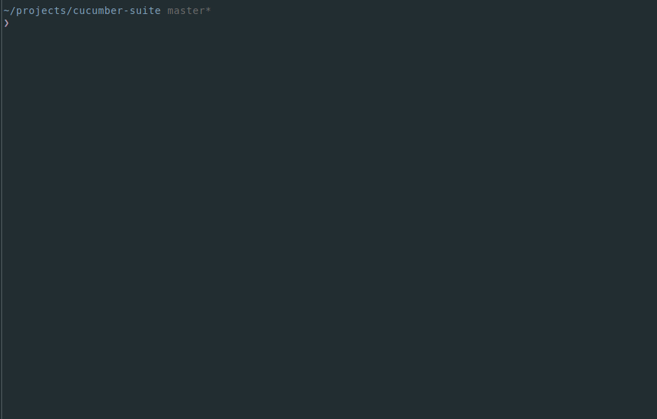
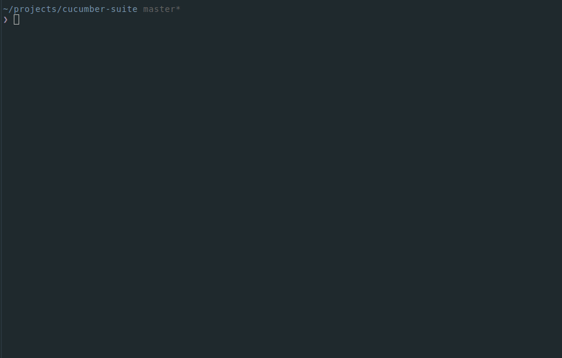

# What the hell is that?
+ [Introduction to cucumber](https://docs.cucumber.io/guides/overview/)

## Code

+ [Gherkin feature](src/mailReader/mailReader.feature)

+ [Cucumber Test](src/mailReader/mailReader.steps.js)

+ [MailReader](src/mailReader/mailReader.js)

## Output examples

+ Fail

+ Success

# Do it yourself
> $ git clone https://github.com/f3liperamos/cucumber-suite.git && cd cucumber-suite

> $ npm install

> $ npm test
